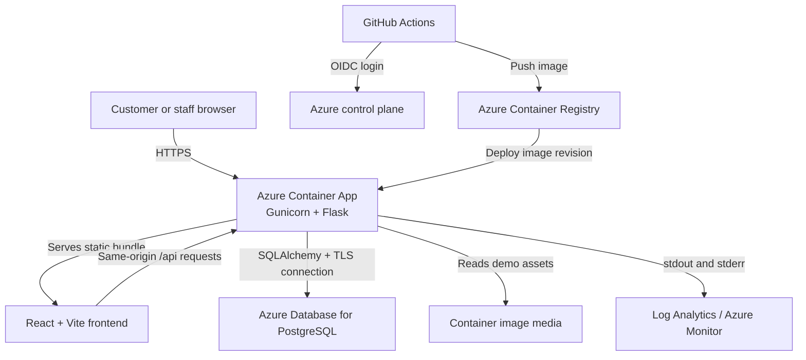

# 1. Production Support and Testing Scenarios

[Back to documentation index](README.md)

## 1.1 Service dependency diagram



## 1.2 Production inventory

| Component | Production resource | Role |
|---|---|---|
| Web/API runtime | `photos-by-greg-app` Azure Container App | Serves React and Flask API through Gunicorn |
| Container registry | `ca563b299433acr` | Stores commit-tagged Docker images |
| Database | `photos-by-greg-db-jog` PostgreSQL Flexible Server | Persists bookings, clients, galleries, projects, products, orders, consent, and AI suggestions |
| Container environment | `photos-by-greg-env` | Network and runtime boundary for the container app |
| Logging | `workspace-photosbygregg9hRX` | Receives container logs and platform telemetry |
| CI/CD | GitHub Actions | Builds and deploys `main` through Azure OIDC |
| Source control | GitHub repository | Version history, pull requests, workflow results, and issue tracking |

## 1.3 Monitoring and health checks

### Where to look

| Signal | Location | Healthy condition | Operator action |
|---|---|---|---|
| Public health | Production `/health` | HTTP 200 and `{"status":"healthy"}` | If unhealthy, inspect the newest Azure revision and logs |
| Container status | Azure Portal → Container App → Overview | Status `Running` and an active revision | Restart or shift traffic to the last known-good revision |
| Application logs | Azure Portal → Container App → Monitoring → Log stream | No repeating startup, database, or 5xx errors | Capture timestamp/correlation details and follow a runbook |
| Central logs | Log Analytics workspace | Requests and errors arrive from the active revision | Query around the incident window |
| Deployment | GitHub → Actions | Latest `main` workflow is green | Open failed job and inspect the first failed step |
| Database | Azure Portal → PostgreSQL Flexible Server | Server available; connections within limit | Verify firewall, credentials, database name, and server state |
| Functional smoke | `/api/products`, `/api/galleries`, `/api/admin/dashboard` | HTTP 200 and valid JSON | Compare API error to container and database logs |

The `/health` route confirms that the Flask process is responding. It is a liveness check, not a deep database-readiness check. The API smoke endpoints provide the additional database validation.

### Suggested Log Analytics query

```kusto
ContainerAppConsoleLogs_CL
| where ContainerAppName_s == "photos-by-greg-app"
| where TimeGenerated > ago(30m)
| project TimeGenerated, RevisionName_s, Log_s
| order by TimeGenerated desc
```

Field names can vary as Azure evolves the Container Apps schema. If the query returns no rows, use the portal's query builder or inspect the current table schema first.

## 1.4 Incident triage

| Severity | Example | Response target |
|---|---|---|
| P1 | Application unavailable or active data at risk | Begin immediately; restore last known-good service first |
| P2 | Booking, merchandise, or CRM workflow blocked | Begin within 30 minutes |
| P3 | One view, style, or demo-data issue | Diagnose during the same working session |

For every incident: record the UTC time, production URL, affected workflow, active revision, Git commit, browser/API response, first relevant log line, mitigation, and verification evidence. Never paste database passwords, Azure credentials, or GitHub secrets into an issue.

## 1.5 Common incidents and recovery

### Application returns 5xx or will not load

1. Open `/health` in a new private browser window.
2. Check Azure Container App **Revisions and replicas** for a failed or inactive revision.
3. Inspect **Log stream** for import, startup, port, or database errors.
4. Confirm the container listens on port `8080`; the Dockerfile starts Gunicorn with `--bind 0.0.0.0:8080`.
5. If the newest revision is faulty, route traffic to the previous healthy revision.
6. Correct the code or environment configuration in a branch, run all tests/builds, merge, and watch the deployment.
7. Re-run the smoke checklist in section 1.8.

### Database connection loss

Symptoms include 500 responses from API endpoints, SQLAlchemy/psycopg errors, and an otherwise healthy web process.

1. Confirm the PostgreSQL Flexible Server is running.
2. Verify `DATABASE_URL` exists in the Container App and is not accidentally exposed as plain documentation or source code.
3. Check hostname, port `5432`, database name, username, SSL requirements, and network/firewall rules.
4. Confirm the database has not reached its connection limit.
5. Restart the failing revision only after configuration is correct.
6. Validate `/api/products` and `/api/admin/dashboard`; then create and read a disposable local test record if deeper validation is required. Do not alter production records merely for a health check.

### Blank React page

1. Open browser developer tools and record the first uncaught exception.
2. Check whether an API field is `null` where the component expects an object or array.
3. Verify `VITE_API_BASE_URL` and the API response in the Network tab.
4. Add safe defaults at the API boundary, not scattered only across rendered components.
5. Run `npm.cmd run build`, refresh without cache, and repeat the affected navigation flow.

### Browser reports a CORS error

1. Confirm the request URL and `Origin` in browser developer tools.
2. Verify `FRONTEND_ORIGINS` includes the exact scheme, hostname, and port for the client.
3. Keep CORS scoped to `/api/*`; do not use `*` for a production credentialed application.
4. Create a new revision after changing the environment variable and repeat the request.

### Demo products or photos are missing

1. Verify the active Container App revision includes `SEED_DEMO_DATA=true` for the capstone demo.
2. Inspect startup logs for seeding errors.
3. Confirm static image paths exist in the deployed image.
4. Confirm the database queries return products, galleries, and consent-approved photos.
5. Re-seeding is idempotent; it should not duplicate the named demonstration records.

### GitHub Actions deployment fails

1. Open the newest GitHub Actions run and expand the first red step.
2. For Azure Login failures, verify the workflow has `id-token: write` and that the federated identity/secrets refer to the subscription containing the resources.
3. Verify the deployment identity has required rights at the intended scope and ACR push access.
4. For build failures, reproduce with `docker build` or the exact frontend/backend commands locally.
5. Re-run only after correcting the root cause; do not repeatedly rerun an unchanged failing workflow.

### Order is not visible in Admin CRM

1. Confirm the cart contained at least one item before checkout.
2. Inspect the POST `/api/orders` response and browser console.
3. Refresh Admin CRM and filter by the new order identifier/customer.
4. Verify the selected photograph has merchandise consent.
5. Check Flask logs and database transaction rollback messages.

## 1.6 Automated test scenarios and results

Command:

```powershell
python -m unittest discover -s tests -v
```

Verified result: **15 tests passed** on August 25, 2026.

| Type | Scenario | Expected result | Actual result |
|---|---|---|---|
| Integration | Health endpoint | 200 healthy response | Pass |
| Integration | Valid booking CRUD | Create, read, update, and delete persist correctly | Pass |
| Validation | Invalid booking payload | Controlled 4xx response; no persistence | Pass |
| Validation | Past appointment date | Request rejected | Pass |
| Resilience | Malformed JSON | Controlled response instead of process crash | Pass |
| Security/config | Configured CORS origin | Expected origin is allowed | Pass |
| Integration | Dashboard aggregation | Platform totals match persisted activity | Pass |
| Integration | Yearbook progress | Student/page changes update progress | Pass |
| Integration | Stay Connected | Profile, social link, and life event persist | Pass |
| Consent | Merchandise without authorized photo | Order rejected | Pass |
| Merchandise | Order status transitions | Valid next states persist; invalid transitions reject | Pass |
| Consent/AI | Assistant without consent | Analysis blocked | Pass |
| AI governance | Suggestion approval | Human approval is recorded | Pass |
| Demo data | Seed rerun | Named demonstration records are not duplicated | Pass |
| Portfolio | Published gallery data | Consent-aware galleries/photos return correctly | Pass |

The exact executable test methods live in [`tests/test_api.py`](../tests/test_api.py) and [`tests/test_platform_api.py`](../tests/test_platform_api.py). The suite primarily uses Flask's test client and an isolated test database, so these are integration tests with targeted validation assertions. No separate isolated React unit-test suite currently exists.

## 1.7 Manual end-to-end test cases

| ID | User workflow | Expected | Actual (2026-08-25) |
|---|---|---|---|
| E2E-01 | Select service, enter contact/session details, choose date/time, review booking | Booking is created and visible in Booking/Admin CRM | Pass |
| E2E-02 | Open Portfolio and inspect Picture Day, Family, and Graduation galleries | Published gallery cards and photographs display | Pass |
| E2E-03 | Open Merchandise, choose approved photo/product/color/size/quantity, add to cart, check out | Total is calculated; confirmation includes order; order appears in CRM | Pass |
| E2E-04 | Move order Ordered → Printing → Out for Delivery → Delivered | Each allowed status persists and is visible | Pass |
| E2E-05 | Generate Photo Assistant suggestions for an authorized image, then approve | Draft caption/alt text/tags/recommendation display; human approval records | Pass |
| E2E-06 | Attempt assistant/order flow with missing consent | Action is prevented with a clear message | Pass |
| E2E-07 | Add social profile and life event | HTTPS link and event appear on customer profile | Pass |
| E2E-08 | Open yearbook workspace | School/project/student/page metrics render without errors | Pass |

## 1.8 Post-deployment smoke tests

Read-only production validation performed August 25, 2026:

| URL | Expected | Actual |
|---|---|---|
| `/` | React entry page, HTTP 200 | Pass — HTTP 200 |
| `/health` | Healthy JSON, HTTP 200 | Pass — HTTP 200, `healthy` |
| `/api/products` | JSON product list, HTTP 200 | Pass — 8 products |
| `/api/galleries` | JSON gallery list, HTTP 200 | Pass — 3 published galleries |
| `/api/admin/dashboard` | JSON metrics, HTTP 200 | Pass — dashboard data returned |

After every production deployment:

1. Confirm the GitHub Actions run is green.
2. Confirm the new Azure revision is active and receiving traffic.
3. Run the five read-only checks above.
4. Open Booking, Portfolio, Merchandise, and Admin CRM in a private browser window.
5. Confirm images and navigation render at desktop and mobile widths.
6. If a write-path test is required, use an explicitly identified demo record and remove it afterward through supported application behavior.

