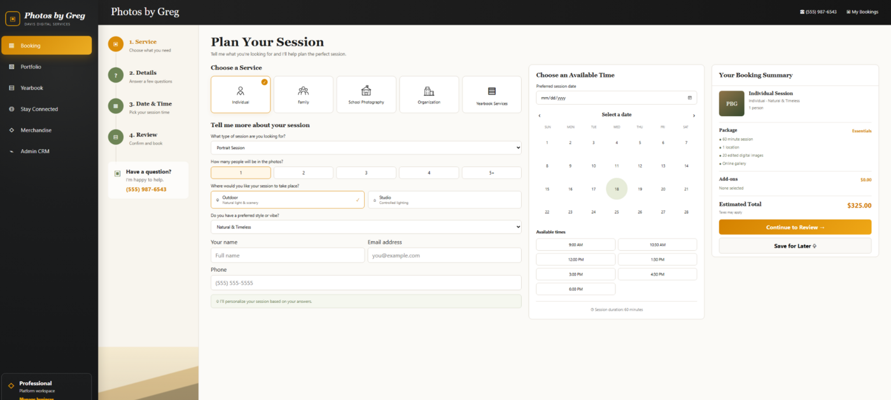
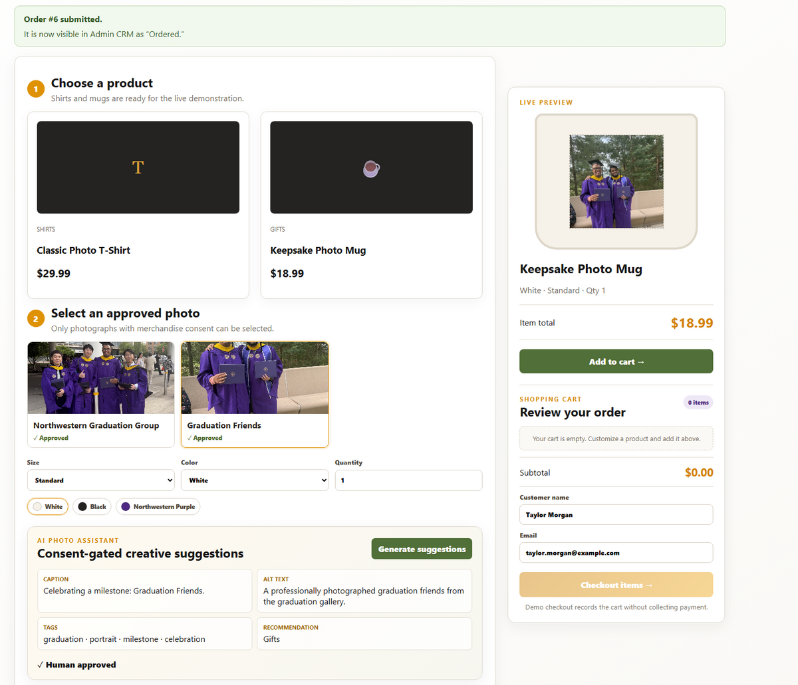

# 4. System Usage Guide

[Back to documentation index](README.md)

## 4.1 Who this guide is for

This guide is written for photography customers, school coordinators, and Photos by Greg staff. No development tools are required.

## 4.2 Access the application

Open [Photos by Greg](https://photos-by-greg-app.bluewater-75d91b54.westus2.azurecontainerapps.io) in a current version of Edge, Chrome, Firefox, or Safari.

The capstone demonstration does not require a test username or password. Authentication and separate customer/staff roles are planned future work, so do not enter sensitive personal or payment information.



## 4.3 Navigation

| Menu | Purpose |
|---|---|
| Booking | Plan an individual, family, school, organization, or yearbook session |
| Portfolio | View published Picture Day, Family, and Graduation work |
| Yearbook | Track schools, students, portrait receipt, pages, and approvals |
| Stay Connected | Store a customer profile, approved social links, and life events |
| Merchandise | Personalize approved photos on keepsakes and submit a demo order |
| Admin CRM | Review bookings, customers, projects, galleries, and order status |

On a narrow screen, use the menu control to open the same navigation options.

## 4.4 Book a photography session

1. Select **Booking**.
2. Choose a service: Individual, Family, School Photography, Organization, or Yearbook Services.
3. Select the session type, number of people, location, and visual style.
4. Enter name, email, and phone.
5. Choose an available date and time.
6. Review the package and estimated total.
7. Select **Continue to Review** and confirm the request.
8. Use **My Bookings** or Admin CRM to confirm that the booking was recorded.

This is a booking request workflow; it does not process payment.

## 4.5 Browse the portfolio

1. Select **Portfolio**.
2. Choose Picture Day Highlights, Family Stories, or Graduation Celebration.
3. Review only the images published with portfolio permission.

Portfolio cover images and merchandise source images may differ. The merchandise workflow retains the original consent-approved graduation images.

## 4.6 Manage a yearbook project

1. Select **Yearbook**.
2. Open the demonstration school/project.
3. Review student/portrait totals and page progress.
4. Use Pages and Approvals to identify outstanding work.
5. Confirm overdue sections before final approval.

The capstone demonstrates progress tracking; it does not send a book to an external printer.

## 4.7 Stay connected

1. Select **Stay Connected**.
2. Open or create the customer profile.
3. Add an Instagram, Facebook, or LinkedIn URL only when the customer has supplied and approved it.
4. Add a life event such as graduation, a new job, or an anniversary.
5. Save and confirm the new item appears on the profile.

Use complete `https://` links. The platform stores links; it does not scrape or continuously import social-network content.

## 4.8 Order merchandise



1. Select **Merchandise**.
2. Open the product menu and choose a T-shirt, mug, hat, photo cube, stickers, or magnets.
3. Select an approved photograph. Images without merchandise consent cannot be selected.
4. For a shirt, choose size and color; Northwestern Purple is available.
5. Choose quantity and inspect the live preview and item total.
6. Select **Add to cart**. The cart count and subtotal must update before checkout.
7. Add another item or review the cart.
8. Enter the demonstration customer name and email.
9. Select **Checkout items**.
10. Confirm the success message includes an order number and says the order is visible in Admin CRM.

No payment is collected. The checkout creates a demonstration order record only.

## 4.9 Use the AI Photo Assistant

1. Select a photograph with analysis consent.
2. Select **Generate suggestions**.
3. Review the draft caption, alt text, gallery tags, and merchandise recommendation.
4. Correct anything inaccurate or inappropriate.
5. Select the human-approval action before treating the suggestions as approved.

The assistant does not run when consent is missing. Its output is a draft, never an automatic publishing decision.

## 4.10 Process an order in Admin CRM

1. Select **Admin CRM**.
2. Open the Orders module.
3. Locate the order number from the checkout confirmation.
4. Advance the order through the supported sequence:

```mermaid
stateDiagram-v2
    [*] --> Ordered
    Ordered --> Printing
    Printing --> "Out for Delivery"
    "Out for Delivery" --> Delivered
```

5. Confirm each update before moving to the next state.
6. Do not skip steps or move a delivered order backward.

The physical class demonstration may use a prepared shirt/mug and a classmate acting as a driver. That performance is separate from carrier integration; the software currently records status only.

## 4.11 Known limitations and gotchas

- There is no authentication or role-based access control; this is the most important pre-public-launch gap.
- Checkout does not collect payment, calculate tax/shipping, call a print vendor, or notify a real carrier.
- Do not click checkout until at least one item appears in the cart.
- Seed data is for demonstration and can reappear when demo seeding is enabled.
- Media files are packaged with the container; uploads and durable cloud media storage are future work.
- Social links are stored references, not live social feeds.
- AI suggestions are template-driven/demonstration behavior and require human approval.
- Calendar availability is illustrative; it is not synchronized with Google or Microsoft calendars.
- Use a private/incognito window or hard refresh if a new deployment appears cached.

## 4.12 Get support

For a reproducible problem, [open a GitHub issue](https://github.com/jamesgrey2026-ops/photos-by-greg-booking-app/issues) and include:

- the page and action;
- expected and actual behavior;
- date/time and browser;
- order/booking identifier if it contains no sensitive data;
- a redacted screenshot or console error.

Never include passwords, database URLs, Azure secrets, or private customer details.

