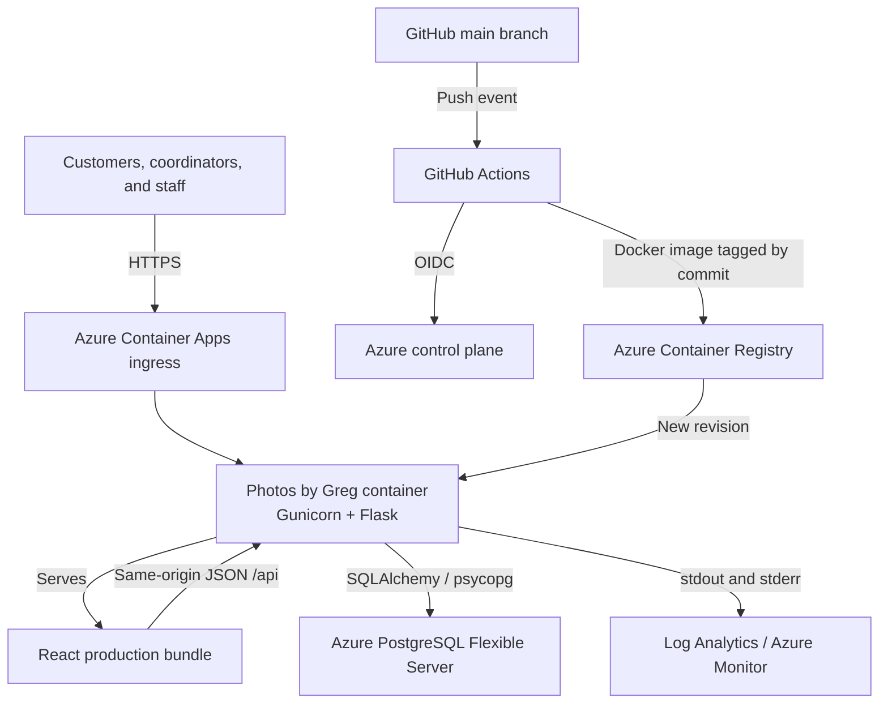
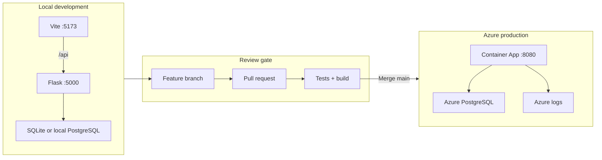
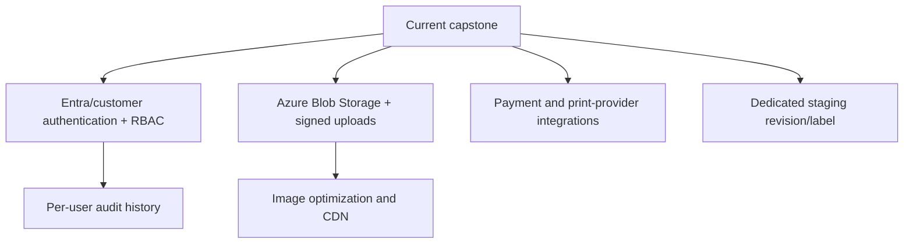

# 5. Architecture

[Back to documentation index](README.md)

## 5.1 High-level production architecture

The application uses one production container. Flask/Gunicorn serves the compiled React assets and the REST API, so browser-to-API calls stay on the same production origin. Persistent business data lives in PostgreSQL; container revisions remain replaceable.

## 5.2 Component roles

| Layer | Technology | Responsibility |
|---|---|---|
| Presentation | React + Vite | Navigation, forms, galleries, booking planner, merchandise preview/cart, CRM views |
| API | Flask + Flask-RESTful | Request routing, validation, workflow rules, JSON responses |
| Data access | Flask-SQLAlchemy + psycopg | Model mapping, queries, transactions, rollbacks |
| Runtime | Gunicorn in Docker | Production WSGI process and portable deployment artifact |
| Data | Azure Database for PostgreSQL | Durable relational records |
| Hosting | Azure Container Apps | HTTPS ingress, revisions, replicas, environment variables, scaling |
| Registry | Azure Container Registry | Private, commit-tagged container images |
| Delivery | GitHub Actions + Azure OIDC | Automated build/push/deploy without a long-lived Azure password |
| Observability | Container logs + Log Analytics/Azure Monitor | Application and platform troubleshooting |

## 5.3 Application modules and data

| Module | Principal data |
|---|---|
| Booking | Customer, service, date/time, location, status |
| Portfolio | Gallery, photo, publication permission |
| Yearbook | School, project, student, page, approval/progress |
| Stay Connected | Client profile, social links, life events |
| Merchandise | Product, authorized photo, options, cart/order, status |
| AI Photo Assistant | Consent check, caption, alt text, tags, recommendation, human approval |
| Admin CRM | Aggregated customers, bookings, schools, projects, orders, revenue |

## 5.4 Request and data flow

1. A user loads `/`; Azure ingress forwards the request to the active Container App revision.
2. Flask serves `frontend/dist/index.html` and bundled assets.
3. React calls same-origin `/api/*` endpoints.
4. Flask validates the request and applies business rules such as date validation, consent checks, cart totals, and valid status transitions.
5. SQLAlchemy reads/writes PostgreSQL. Exceptions trigger transaction rollback and a controlled API response.
6. React updates the interface from the JSON response.
7. Gunicorn/Flask writes operational messages to stdout/stderr for Azure collection.

## 5.5 Environment topology

There is no separate always-on staging deployment today. The feature branch/pull-request gate and local Docker validation act as pre-production controls. A dedicated staging Container App or deployment label is recommended before public launch.

## 5.6 External interfaces

| Interface | Protocol | Notes |
|---|---|---|
| Browser ↔ Container App | HTTPS | Azure-managed public endpoint |
| React ↔ Flask | HTTPS/JSON in production | Same origin; `/api/*` |
| Flask ↔ PostgreSQL | PostgreSQL protocol through psycopg | Connection string supplied as a secret |
| GitHub Actions ↔ Azure | OIDC + Azure APIs | Short-lived federated token |
| GitHub Actions ↔ ACR | Registry HTTPS | Pushes commit-tagged image |
| Social profile links | Outbound browser HTTPS | Stored user-supplied links; no social API integration |

No payment gateway, print vendor API, shipping carrier API, or external model API is currently connected. These are future integration points, not hidden dependencies.

## 5.7 Resilience and scaling decisions

- The application container is stateless with respect to business records; persistent data is externalized to PostgreSQL.
- Container Apps revisions provide a deployable rollback unit.
- The `/health` endpoint provides liveness; database-backed GET endpoints provide deeper smoke validation.
- Gunicorn runs multiple workers/threads within the configured container resource limit.
- Demo images packaged in the container simplify the capstone but do not provide scalable media storage.
- Database backup/restore follows the PostgreSQL Flexible Server policy configured in Azure and should be tested before public launch.

## 5.8 Target evolution

The architecture deliberately keeps these items outside the current boundary so the capstone does not imply production controls that have not yet been implemented.

