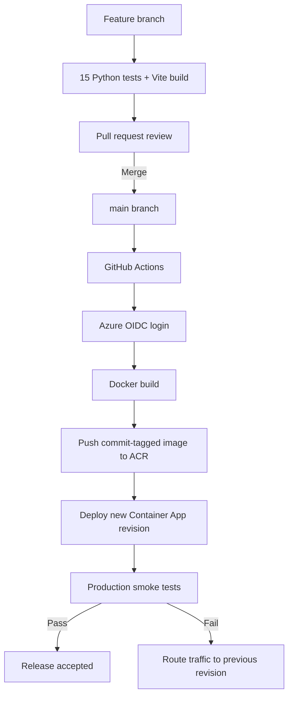

# 6. Deployment Pipeline and Rollback

[Back to documentation index](README.md)

## 6.1 Current pipeline



The workflow is stored in `.github/workflows/` and triggers on a push to `main` or manual dispatch. It uses `azure/login` and `azure/container-apps-deploy-action`, publishes to `ca563b299433acr.azurecr.io`, and updates `photos-by-greg-app` in `photos-by-greg-rg`.

## 6.2 Required release checks

Before merge:

```powershell
python -m unittest discover -s tests -v
cd frontend
npm.cmd run build
cd ..
git status -sb
```

Acceptance criteria:

- 15 tests pass.
- Vite production build passes.
- No untracked patch/archive or `.env` file is staged.
- PR description lists user impact, consent/data implications, and verification.
- UI changes are visually checked at desktop and mobile widths.
- Database/model changes include a safe migration or explicit upgrade plan.

## 6.3 Identity and secrets

The workflow requests `id-token: write` and exchanges the GitHub OIDC token through `azure/login`. GitHub stores identifiers such as Azure client, tenant, and subscription IDs as repository secrets; Azure holds the federated trust and RBAC assignment.

Use [GitHub's Azure OIDC guidance](https://docs.github.com/actions/deployment/security-hardening-your-deployments/configuring-openid-connect-in-azure) and [Microsoft's Azure Login OIDC guide](https://learn.microsoft.com/en-us/azure/developer/github/connect-from-azure-openid-connect). OIDC avoids a long-lived client secret, but permissions must still be least-privilege and scoped to the required registry/application resources.

## 6.4 Production validation

After the workflow succeeds:

1. In GitHub Actions, confirm every job step is green and note the commit SHA.
2. In Azure, confirm the new revision is healthy and active.
3. Confirm the deployed image tag matches the commit.
4. Run:

```powershell
$base = "https://photos-by-greg-app.bluewater-75d91b54.westus2.azurecontainerapps.io"
Invoke-WebRequest "$base/" -UseBasicParsing
Invoke-RestMethod "$base/health"
Invoke-RestMethod "$base/api/products"
Invoke-RestMethod "$base/api/galleries"
Invoke-RestMethod "$base/api/admin/dashboard"
```

5. Manually open Booking, Portfolio, Merchandise, and Admin CRM.
6. Record the results in the PR/release notes.

## 6.5 Rollback triggers

Rollback immediately when any of these occur after release:

- `/health` fails repeatedly;
- the root page returns 5xx or a blank app;
- database-backed smoke endpoints fail;
- booking/order writes are corrupt, duplicated, or lost;
- a consent gate can be bypassed;
- the deployment exposes a credential or private image;
- the primary demonstration workflow cannot complete.

## 6.6 Revision rollback

Azure Container Apps creates revisions for revision-scope changes and can direct traffic among active revisions. See [Microsoft's revisions guide](https://learn.microsoft.com/en-us/azure/container-apps/revisions) and [revision management](https://learn.microsoft.com/en-us/azure/container-apps/revisions-manage).

Portal procedure:

1. Open `photos-by-greg-app` in Azure Portal.
2. Select **Revisions and replicas**.
3. Identify the last healthy revision by creation time, image tag, and logs.
4. Activate it if necessary.
5. Route 100% of production traffic to that revision.
6. Do not delete the failed revision until evidence has been captured.
7. Run the production smoke tests against the public URL.
8. Open a GitHub issue describing the failed commit and recovery.

CLI discovery commands (operators must first select the correct subscription):

```powershell
az containerapp revision list --name photos-by-greg-app --resource-group photos-by-greg-rg --output table
az containerapp logs show --name photos-by-greg-app --resource-group photos-by-greg-rg --tail 100
```

Traffic commands depend on the app's configured revision mode. Inspect current configuration and follow Microsoft's current revision-management documentation instead of copying an unverified production mutation from this guide.

## 6.7 Database-aware rollback

Routing traffic to an old image does not reverse a database schema/data change.

For any future migration:

1. Back up the database before applying a destructive change.
2. Prefer backward-compatible additive schema changes.
3. Deploy code that can operate with both old and new schema during the transition.
4. Define a separate migration rollback and data-restoration procedure.
5. Test restore in a nonproduction database.

The current application uses `db.create_all()` and does not contain a full migration framework. Add Alembic/Flask-Migrate before production schema evolution.

## 6.8 Pipeline improvement backlog

- Run backend tests and frontend build automatically before image deployment.
- Add dependency and container vulnerability scanning.
- Use current major versions of checkout/login/deployment actions.
- Add a protected GitHub environment with manual production approval.
- Add an Azure staging revision/label and smoke-test it before traffic promotion.
- Publish test results and a software bill of materials as workflow artifacts.
- Add automated browser E2E tests for booking, merchandise, and Admin CRM.

